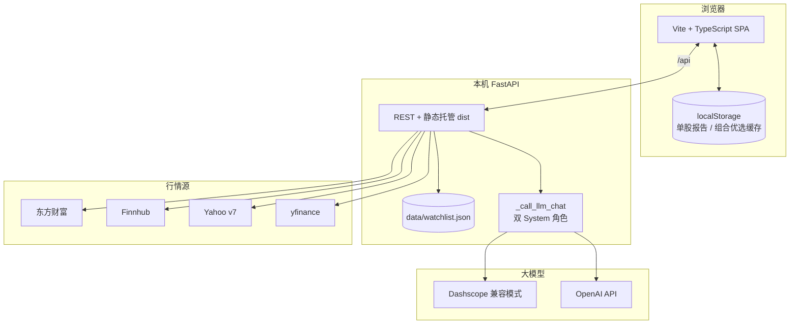
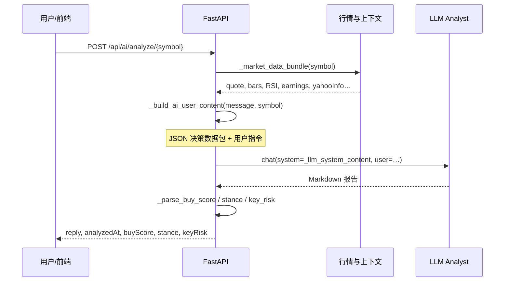
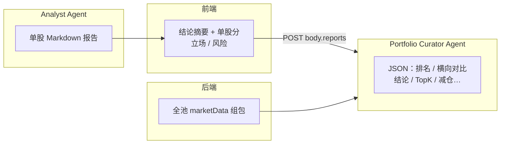

# stock_investment_agent

面向美股投资人的个人辅助工具：维护自选股、多源行情一览，并以 **Analyst Agent（单股）** + **Portfolio Curator（组合优选）** 两条大模型链路提供研究与横向比较。**本文档为产品设计与技术说明**，含架构图；需求迭代时请同步更新。

---

## 技术亮点（AI / 大模型应用开发 · 面试可讲）

以下为本项目在「调用 LLM 做产品时」可被追问的设计点：

| 主题 | 项目中的做法 |
| --- | --- |
| **服务端事实注入（grounding）** | 不向模型「裸喂」符号；`_build_ai_user_content` 将服务端抓取的 JSON **决策数据包**（行情快照、日线、RSI、财报日历、Yahoo Info 摘要等）与用户问题拼装，明确要求 **以数据包为准**、禁止用训练记忆改数字。 |
| **动态 System Prompt** | `_llm_system_content()` 每次请求注入 **UTC / 北京时间** 与强制数据时效规则（联网检索与行情包分层使用），减少幻觉与时效错乱。 |
| **结构化输出抽取** | 单股：`买入推荐评分`、投资立场、主要风险——用正则 `_parse_buy_score` / `_parse_stance` / `_parse_key_risk` 从 Markdown 拉回字段，供前端与组合 Agent 消费。组合：要求 **裸 JSON**，`_parse_portfolio_curate_response` + 服务端校验（全池覆盖、`relativeScore` 不重复、字段合法）。 |
| **可选联网搜索（RAG-ish）** | 通过 `LLM_ENABLE_SEARCH` 等在兼容 OpenAI Chat Completions 的 payload 上打开 `enable_search`（百炼等），prompt 区分「盘面数字来自数据包、事件来自检索」。 |
| **多 Provider / 网关** | `DASHSCOPE_API_KEY` / `OPENAI_API_KEY`、`OPENAI_BASE_URL`、`OPENAI_MODEL` / `QWEN_MODEL`，统一 `_call_llm_chat(user_content, system_content=None)`。 |
| **双 Agent 职责分离** | **Analyst**：单标的深度报告；**Portfolio Curator**：独立 system prompt，输入为全池 `marketData` + 各股摘要/立场/风险，输出购买优先级、TopK 理由、横向对比长文、减仓建议、组合风险——避免「N 次独立打分不可比」问题。 |
| **温度与长度** | `temperature: 0.35`、`max_tokens` 控制，平衡稳定性与信息量。 |
| **前端侧缓存策略** | 单股报告与组合优选结果按 **北京自然日** + 标的集合 key 存 `localStorage`，减少重复 tokens；与后端「今日有效」语义一致。 |
| **工程形态** | FastAPI 单文件承载行情多源切换 + LLM 编排 + 静态站点托管；前端 Vite + TS 无框架，事件委托与薄状态。 |

---

## 1. 目标用户与场景

| 项目 | 说明 |
| --- | --- |
| 用户 | 个人美股投资者（单用户） |
| 核心场景 | 维护自选；查看价格与涨跌；单股 AI 研报；自选池内 **组合横向优选**（含 Top3、减仓提示、组合风险） |
| 非目标 | 非投顾、非实盘交易、非多租户 SaaS |

---

## 2. 总体架构

### 2.1 系统组件



- **前端**：开发时 Vite 代理 `/api`；`npm run build` 后由 FastAPI 同域托管 `frontend/dist`。
- **后端**：自选 JSON 持久化；行情按 `QUOTE_PROVIDER` 切换（见下）。
- **不接入百度财经网页**（无稳定公开 JSON 合同）。境内优先 **东方财富** 公开接口。

**`QUOTE_PROVIDER`**（`backend/.env`，默认 `auto`）：

- **`eastmoney`**：推荐大陆网络，无需 Finnhub。
- **`finnhub`**：需 `FINNHUB_API_KEY`。
- **`yahoo`**：Yahoo v7 + yfinance 兜底。
- **`auto`**：有 Finnhub key 用 Finnhub，否则东财。

东财 `push2` 使用 **`invt=2&fltt=2`** 等与网页一致参数；遇整数档位时按 `f152` 与位数推算除数，避免与终端差数量级。

### 2.2 大模型数据流（单股分析）



### 2.3 双 Agent：组合优选（Portfolio Curator）



**设计要点**：

- 优选前要求池内每只已有 **当日** 单股报告（前端校验）；Curator 将 `analystAgent` 摘要与 **全自选** `marketData` 一并投喂，单次对话完成横向标尺与排序。
- 输出含 **`horizontalComparison`（横向对比正文）**、**`conclusion`**、**每只 `compareReason`**、**TopK 理由**、**减仓/调出**、**portfolioRisks**；服务端校验分数不重复且覆盖全集。

`/api/ai/portfolio/curate` 与 `/api/ai/watchlist/rank` 为同一逻辑别名。

---

## 3. 目录结构（约定）

| 路径 | 职责 |
| --- | --- |
| `README.md` | 产品设计、架构、API、AI 链路、运行与路线图 |
| `backend/main.py` | FastAPI：行情多源、`/api/ai/*`、自选 CRUD |
| `backend/data/watchlist.json` | 自选股权威存储 |
| `backend/requirements.txt` | Python 依赖 |
| `backend/.env` / `.env.example` | 密钥与开关（勿提交 `.env`） |
| `frontend/src/main.ts` | 主界面、自选表、路由与事件委托 |
| `frontend/src/aiReports.ts` | 单股报告本地缓存 |
| `frontend/src/watchlistRank.ts` | 组合优选结果缓存与校验 |
| `frontend/src/stockPage.ts` | 搜索抽屉、自选心形按钮 |
| `frontend/src/settings.ts` / `appShell.ts` | 显示偏好与底栏 |

---

## 4. 数据模型

### 4.1 自选股文件 `backend/data/watchlist.json`

```json
{
  "symbols": ["MU", "AMD", "TSLA"]
}
```

代码校验：`^[A-Z0-9.\-]{1,10}$`（如 `BRK.B`）。

### 4.2 行情对象（`GET /api/quotes` 单条）

| 字段 | 说明 |
| --- | --- |
| `symbol` / `name` / `lastPrice` / `previousClose` / `change` / `changePercent` / `currency` / `error` | 与此前一致 |

---

## 5. HTTP API 约定

Base URL：`http://127.0.0.1:8000`；Vite 开发时前端走 `/api` 代理。

| 方法 | 路径 | 说明 |
| --- | --- | --- |
| `GET` | `/api/health` | `ok`、`finnhub_configured`、`quote_provider`、`llm_configured`、`llm_provider` 等 |
| `GET` | `/api/symbols/search` | 美股代码/名称搜索（东财 searchadapter） |
| `GET` | `/api/watchlist` | 自选列表 |
| `PUT` | `/api/watchlist` | Body `{"symbols":["A","B"]}` 全量覆盖 |
| `POST` | `/api/watchlist/symbol` | Body `{"symbol":"NVDA"}` 追加 |
| `DELETE` | `/api/watchlist/symbol/{symbol}` | 删除 |
| `GET` | `/api/quotes` | 按当前自选拉行情 |
| `POST` | `/api/ai/chat` | 对话；Body `message`、`symbol?` |
| `POST` | `/api/ai/analyze/{symbol}` | 单股研报；返回 `reply`、`buyScore`、`stance`、`keyRisk` |
| `POST` | `/api/ai/watchlist/rank` | 组合优选；Body `symbols?`、`topK`、`reports[]` |
| `POST` | `/api/ai/portfolio/curate` | 同上（别名） |

---

## 6. 前端功能（当前）

- 底栏：**自选 / 个股 / AI 分析**；自选按 **全部 / 美股 / 港股** Tab（港股占位）。
- 自选：**搜索**打开股票抽屉；**一键**批量单股分析；评分列 **优选** → 完成后 **查看** 打开组合优选底部弹层（横向对比、结论、全表、减仓与风险）。
- 单股页：内嵌外链行情；**爱心**加减自选。
- AI 页：对话；报告侧拉查看当日单股研报。
- 显示偏好：涨跌色、名称/代码顺序、紧凑、US 角标、列互换、外链新开等 → `localStorage`。

---

## 7. 本地运行

**`8000` 与 `5173`**

| 地址 | 作用 |
| --- | --- |
| `http://127.0.0.1:8000` | FastAPI，`/api/...`；未 build 前端时 `/` 可能为占位说明 |
| `http://127.0.0.1:5173` | Vite 开发，`/api` 代理到 8000 |

**终端 A — 后端**

```bash
cd backend && source .venv/bin/activate && uvicorn main:app --reload --host 127.0.0.1 --port 8000
```

- 复制 `backend/.env.example` → `backend/.env`，配置 `FINNHUB_API_KEY`、`QUOTE_PROVIDER`、`DASHSCOPE_API_KEY` 或 `OPENAI_API_KEY` 等。
- 大陆网络建议：`QUOTE_PROVIDER=eastmoney`。
- SSL 问题：`pip install -r requirements.txt`（含 certifi）。

**终端 B — 前端开发**

```bash
cd frontend && npm install && npm run dev
```

**仅后端 + 内置静态：**

```bash
cd frontend && npm run build
```

再启动 uvicorn；打开 `http://127.0.0.1:8000/`。

---

## 8. 路线图

| 状态 | 项目 |
| --- | --- |
| 已完成 | 自选 JSON；多源行情；东财/Finnhub/Yahoo；单股 AI + 批量；**组合优选双 Agent**；本地报告/优选缓存；README 架构与亮点 |
| 已取消（按当前产品） | 自选 **分组 / 自建文件夹**（曾实验后移除，保持单一主列表） |
| 待定 | 港股行情与列表；盘中实时推送；K 线/财务面板；告警；认证与多账户 |
| 待定 | watchlist → SQLite/PG；Docker；行情合并请求与短时缓存 |
| 待定 | Analyst 输出完全 JSON Schema 化（减少正则依赖） |

---

## 9. 变更记录（简）

| 日期 | 说明 |
| --- | --- |
| 2026-05-15 | 初版：FastAPI + watchlist + Vite；Yahoo/yfinance；README |
| 2026-05-15 | 东财/FH/Yahoo 切换；`.env`；健康检查；自选样式面板 |
| 后续 | 大模型单股研报；联网搜索开关；**Portfolio Curator** 组合优选、横向对比 JSON、前端「查看」弹层；README 补充 AI 架构与面试亮点 |
